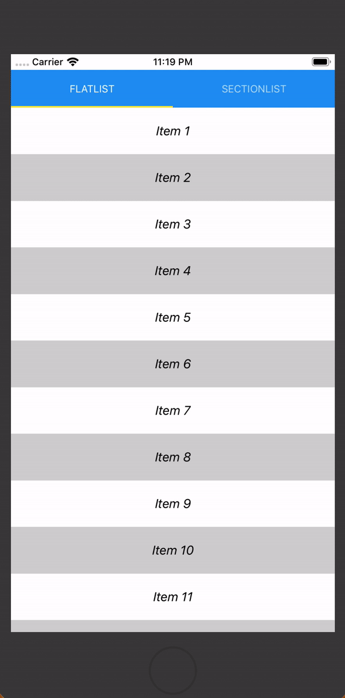
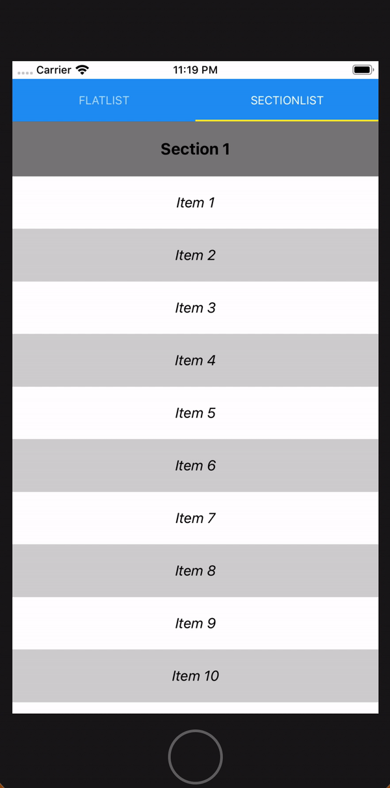

React Native `VirtualizedFlatList` and `VirtualizedSectionList` components.
- Both components use *FlatList* and *SectionList* from *react-native* under the hood
- Zero dependency


| VirtualizedFlatList | VirtualizedSectionList |
| - | - |
|  |  |

## Getting started

Install `react-native-virtualized`:
- `$ npm install react-native-virtualized`
or using yarn
- `$ yarn add react-native-virtualized`

## Usage

- **VirtualizedFlatList:**
  ```jsx
  import React from 'react';
  import { Text } from 'react-native';
  import { VirtualizedFlatList } from 'react-native-virtualized';

  export default function FlatListExample() {
      const items = Array(999999999).fill('Item ')

      return (
          <VirtualizedFlatList
              keyExtractor={(item, index) => item + index}
              data={items}
              renderItem={({ item, index }) => <Text>{`${item} - ${index}`}</Text>}
          />
      );
  }
  ```

- **VirtualizedSectionList:**
  ```jsx
  import React from 'react';
  import { Text } from 'react-native';
  import { VirtualizedSectionList } from 'react-native-virtualized';

  export default function SectionListExample() {
      const sections = Array(999999999).fill('Section ')
        .map((item, index) => ({
            title: item + index,
            data: Array(50).fill('Item ')
        }))

      return (
          <VirtualizedSectionList
              sections={sections}
              keyExtractor={(item, index) => item + index}
              renderItem={({ item, index }) => <Text>{`${item} - ${index}`}</Text>}
              renderSectionHeader={({ section }) => <Text>{section.title}</Text>}
          />
      );
  }
  ```

## Props

- For both `VirtualizedFlatList` and `VirtualizedSectionList`

| Name | Required | Default | Description |
| - | - | - | - |
| `batch` | *No* | 10 | Number of items to load on scroll to end |

**Note:** Rest of the props are passed to the underlying `FlatList|SectionList` component. It means all required by underlying component (*FlatList|SectionList*) props should be passed as usual.


## License

*react-native-virtualized* is available under the MIT License.
